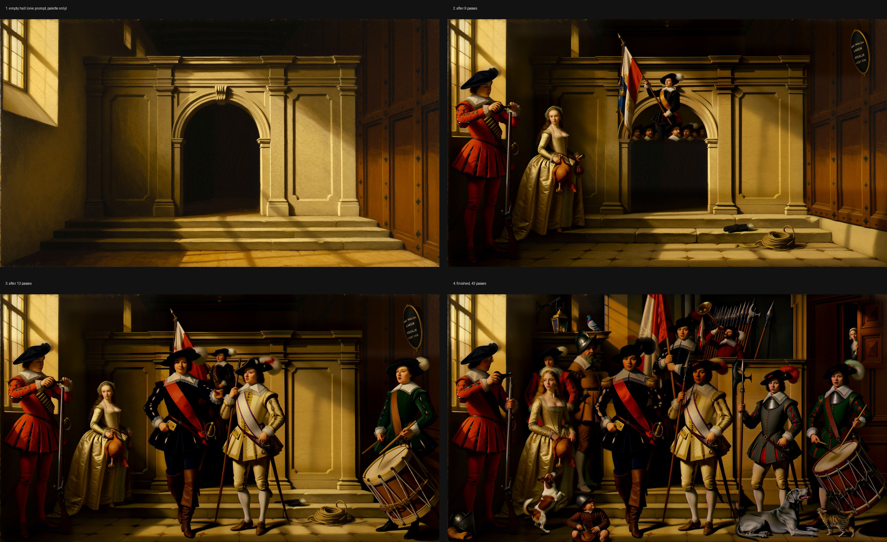

# h3image

**Use MiniMax H3 as an image editor.** H3 is a video model, but ask it for a single frame and it turns
out to be a really good instruction-based image editor, and a large-format text-to-image generator.
This repo gives you ready-made ComfyUI workflows plus a command-line tool, for Apple Silicon and NVIDIA.


*Two images in (a bare wall, a flat artwork), one out. The brick shows through the paint and the design
stops at the window.*

The trick comes from [Patient_Ratio4177](https://www.reddit.com/r/StableDiffusion/comments/1vo1ab3/h3_as_a_singleimage_edit_model/).
This started as the Mac port and now runs on CUDA too.

## What it's good at

Putting a flat asset into a scene *properly*: a label that wraps around a can and sits under the
condensation, a mural that takes on the brick, a neon sign that lights the wall and reflects in wet
pavement, a book cover that follows the book's perspective. Text and logos transfer well in these
examples, though small lettering and occasional character substitutions still need checking.

| | |
|---|---|
|  |  |
|  |  |

*Left of each pair: the inputs. Right: the result. The tattoo (bottom right) is the honest failure: it
looks like a sticker. All brands are made up and every image is AI-generated.*

## 16 MP images


*5440x3072 from one prompt: rendered at 4 MP, upscaled 2x in latent space with the
[H3 latent upscaler](https://github.com/LBH-123-AI/Comfyui_Minimax_h3_latent_Upscaler), then refined
for 16 steps at full size.*

H3 will render 16 MP in one go, but it only looks right from a distance. Zoomed in, glass and ironwork
melt, and more steps barely help (tried 20 and 40). It's sharp at 4 MP, so render there and let
the latent upscaler plus a short refine take it to 16 MP. The `*_16mp` workflows do exactly that.


## Big images, one region at a time


*A 5440x3072 group painting built with `h3-inpaint` in 43 controlled passes: an empty hall first,
then figures and props, back to front. Pixels outside each expanded, feathered edit region are
preserved.*



About a minute per pass on a rented GPU, 6–7 minutes on an M5. The full walkthrough, with commands,
rules and everything that went wrong, is in [Building big images](docs/canvas-builds.md).

## What you can do

| | how | status |
|---|---|---|
| **Edit** an image with an instruction and 1–5 reference images | workflow or CLI | solid |
| **Generate** from text alone (sharpest at 4 MP) | CLI `--generate` | solid |
| **Go to 16 MP**: 4 MP render, 2x latent upscale, 16-step refine | workflow (`*_16mp`) | works; tested on NVIDIA |
| **Inpaint**: change one region, leave the rest untouched | workflow or CLI | works, see limits |
| **Detail**: re-render a soft region sharper | CLI `--detail` | works, see limits |
| **Fix faces** automatically | CLI `--autofix` | experimental |
| **Extend** an image past its edges or to a new aspect ratio | CLI `--outpaint` / `--reframe` | experimental |
| **Build huge images** one region at a time | CLI `h3-inpaint` | advanced ([guide](docs/canvas-builds.md)) |

It's not an upscaler. For that, Qwen-Image-Edit 2.1 does the job well.

## Setup

You need a working ComfyUI. Then:

### 1. Install the one-frame node

Stock ComfyUI won't let H3 render fewer than 5 frames. This small node fixes that without patching
ComfyUI:

```sh
git clone https://github.com/Bambushu/h3image
ln -s "$(pwd)/h3image/custom_nodes/h3_single_frame" /path/to/ComfyUI/custom_nodes/h3_single_frame
```

Restart ComfyUI afterwards.

### 2. Install the node packs

| pack | needed for |
|---|---|
| [ComfyUI-MAINodes](https://github.com/matlowai/ComfyUI-MAINodes) | inpaint, outpaint, big canvases (both platforms) |
| [ComfyUI-GGUF](https://github.com/city96/ComfyUI-GGUF) | Mac |
| [ComfyUI-ClipProj](https://github.com/nicolab28/ComfyUI-ClipProj) | Mac |
| [comfyui-obvpm](https://github.com/obvpm/comfyui-obvpm) | Mac (the `beta57` scheduler) |
| [Comfyui_Minimax_h3_latent_Upscaler](https://github.com/LBH-123-AI/Comfyui_Minimax_h3_latent_Upscaler) | the 16 MP workflows (both platforms) |

On CUDA you also need ComfyUI 0.30 or newer with the MiniMax H3 nodes, and `comfy-kitchen` 0.2.26 or newer.

### 3. Download the models

Paths are relative to ComfyUI's `models/` folder and must match exactly. Check each model's license
before commercial use.

**Apple Silicon** (~33 GB; tested on an M5 with 48 GB):

| file | goes in | size | from |
|---|---|---|---|
| `MiniMax-H3-FL2VA-Pruned-Q5_K_M.gguf` | `diffusion_models/_h3/` | 14.1 GB | [Abiray/MiniMax-H3-Pruned-GGUF](https://huggingface.co/Abiray/MiniMax-H3-Pruned-GGUF) |
| `qwen3vl_8b_fp8_scaled.safetensors` | `text_encoders/_h3/` | 10.6 GB | [Comfy-Org/Qwen3-VL](https://huggingface.co/Comfy-Org/Qwen3-VL/tree/main/text_encoders) |
| `mmh3-8b-ClipProj-celeb-mlp.safetensors` | `clip_projections/` | 0.4 GB | [NicoLab28/ClipProj-MiniMax-H3](https://huggingface.co/NicoLab28/ClipProj-MiniMax-H3) |
| `minimax_h3_video_vae_fp16.safetensors` | `vae/_h3/vae/` | 3.2 GB | [Comfy-Org/MiniMax-H3](https://huggingface.co/Comfy-Org/MiniMax-H3) |
| `minimax_h3_audio_vae_fp32.safetensors` | `vae/_h3/vae/` | 0.6 GB | [Comfy-Org/MiniMax-H3](https://huggingface.co/Comfy-Org/MiniMax-H3) |
| `H3-PK-Parasyte-Turbo.safetensors` | `loras/` | 2.1 GB | [Plaguekind/H3-Lora](https://huggingface.co/Plaguekind/H3-Lora) |

**NVIDIA** (Blackwell only, so RTX 50xx or RTX PRO, on driver 580 or newer), all from the
[Comfy-Org/MiniMax-H3](https://huggingface.co/Comfy-Org/MiniMax-H3) repack:

| file | goes in |
|---|---|
| `minimax_h3_fl2va_int8_convrot.safetensors` | `diffusion_models/` |
| `qwen3vl_32b_minimax_h3_int8_convrot.safetensors` | `text_encoders/` |
| `minimax_h3_video_vae_fp16.safetensors`, `minimax_h3_audio_vae_fp32.safetensors` | `vae/` |

Yes, the audio VAE is needed even for stills.

**For the 16 MP workflows** (both platforms): `minimax_h3_latent_upscaler_3d_bf16.safetensors` (0.7 GB)
in `latent_upscale_models/`, from
[LBH-123-AI/Minimax_h3_latent_Upscaler](https://huggingface.co/LBH-123-AI/Minimax_h3_latent_Upscaler).

### 4. (Optional) Install the CLI

```sh
pip install git+https://github.com/Bambushu/h3image      # or from a checkout: uv tool install -e .
# Use your ComfyUI URL. API transport works even when its input/output folders are elsewhere.
export H3EDIT_COMFY=http://127.0.0.1:8188
export H3EDIT_TRANSPORT=upload
h3edit --doctor                                       # Apple Silicon
h3edit --profile cuda --doctor                        # NVIDIA Blackwell
```

Set `H3EDIT_COMFY` to the URL your ComfyUI actually uses (the CLI's default is `127.0.0.1:8288`).
`H3EDIT_TRANSPORT=upload` sends inputs and retrieves outputs through ComfyUI's API, including on
localhost. To use shared files instead, set `H3EDIT_TRANSPORT=shared` **and** `H3EDIT_INPUT` /
`H3EDIT_OUTPUT` to that installation's actual input/output folders; their defaults assume
`~/ComfyUI-h3/`.

The commands above use a Unix shell. In PowerShell, set the variables with
`$env:H3EDIT_COMFY = "http://127.0.0.1:8188"` and `$env:H3EDIT_TRANSPORT = "upload"`.
For the one-frame node on Windows, copy `h3image/custom_nodes/h3_single_frame` into your
ComfyUI `custom_nodes` folder instead of using `ln -s`, then restart ComfyUI.
Extras: `[autofix]` for face fixing, `[score]` for canvas scoring.

## Using the ComfyUI workflows

Drag one of these into ComfyUI:

| workflow | what it does |
|---|---|
| [`h3image_edit_mac.json`](workflows/h3image_edit_mac.json) / [`h3image_edit_cuda.json`](workflows/h3image_edit_cuda.json) | two images in, one edited image out |
| [`h3image_inpaint_mac.json`](workflows/h3image_inpaint_mac.json) / [`h3image_inpaint_cuda.json`](workflows/h3image_inpaint_cuda.json) | paint over the part to change in the MaskEditor; the rest stays untouched |
| [`h3image_edit_16mp_mac.json`](workflows/h3image_edit_16mp_mac.json) / [`h3image_edit_16mp_cuda.json`](workflows/h3image_edit_16mp_cuda.json) | the edit workflow at 4 MP, then 2x latent upscale and a 16-step refine: ~16 MP out. For text-to-image, use a flat gray image as the only reference |

They open with a demo loaded. Copy `gable_scene-s77.png`, `gable_mural-s79.png`, `neon_sign-s42.png`
and `inpaint_example.png` from [`demos/refs/`](demos/refs) into ComfyUI's `input/` folder and hit Queue
to check your setup. Everything you normally touch is in the **1 · Your inputs** group at the top left,
next to a how-to note. Leave group 3 alone: its `length = 1` is what makes the video model render a still.

For inpainting: right-click the source image, choose **Open in MaskEditor**, and paint the area to
change. The image's sides need to be multiples of 32 px (most generator output is).

## Using the CLI

```sh
# edit: the first -r is <Picture 1>, the second <Picture 2>
h3edit "Task: Reference-guided generation. Put the jacket from <Picture 2> on the person in <Picture 1>." \
  -r person.png -r jacket.png --ar 16:9 -o out.png

# generate from text; add --n 6 to get six seeds and a contact sheet to pick from
h3edit --generate "a grand old library interior, sunbeams, checkerboard floor" --ar 16:9 --mp 8 -o library.png

# inpaint: redo one box of an image with new artwork (0.85 keeps the shape, 1.0 re-composes)
h3edit "Task: Reference-guided generation. ..." --inpaint 400,324,2112,1288 --source out.png \
  -r plate.png --denoise 0.85 -o fixed.png

# detail: re-render a soft region sharper (the crop becomes <Picture 1>)
h3edit "$(cat prompts/detail_pass_example.txt)" --detail 1560,700,2320,1460 --source out.png -o sharper.png

# fix faces (look at the boxes first with --dry-run)
h3edit --autofix out.png --dry-run -o boxes.png
h3edit --autofix out.png -o faces_fixed.png

# extend: add 256 px on the right, or widen to 16:9
h3edit "continue the sunlit courtyard, no new people" --outpaint 0,0,256,0 --source in.png -o wider.png
h3edit "continue the beach and sky" --reframe 16:9 --source in.png -o wide.png
```

On NVIDIA, add `--profile cuda` (or set `H3EDIT_PROFILE=cuda`). `-o` waits for the render and saves it.
Every flag is listed in the [technical notes](docs/technical-notes.md#full-flag-reference).

To reproduce the mural at the top:

```sh
h3edit "$(cat demos/prompts/gable.txt)" -r demos/refs/gable_scene-s77.png -r demos/refs/gable_mural-s79.png \
  --ar 16:9 --seed 123494846 -o out.png
```

Every PNG in `demos/out/` embeds its full ComfyUI graph with seed and prompt, so you can drag one into
ComfyUI too.

## Writing prompts that work

Every demo prompt follows this shape:

1. Start with `Task: Reference-guided generation.`
2. Say what each picture is for, **and what it isn't**: "`<Picture 2>` is the label artwork only. It does
   not supply a scene, a container, a background or lighting."
3. Describe the edit, and say **"exactly one"** when you want one of something.
4. List what has to stay the same in `<Picture 1>`.
5. End with "A single coherent photograph shows …".

There are 11 more worked examples in [`prompts/reference_prompts.txt`](prompts/reference_prompts.txt).

**Making the reference artwork:** H3 copies it literally, borders and barcodes included, so generate
clean, asset-only art. The word *poster* adds a border and *label* adds an ingredient panel and barcode;
*mural painting* and *banner* come out clean. On a can, keep the wordmark near the centre, since only
about 40% of a full-width label shows.

## Getting good results

- **Small lettering needs 4 MP.** The model works in 16 px cells, so ~50 px text is mush at 2 MP and
  readable at 4 MP. `--mp` also caps how sharp your reference images arrive.
- **Judge at 100% zoom.** Thumbnails hide broken letterforms.
- **Wrong region? Inpaint. Soft region? Detail.** Inpaint re-composes and can fix a wrong digit; detail
  only sharpens what's already there.
- **Inpaint denoise:** 0.85 adds a prop to bare ground or fixes lettering while keeping the shape; 1.0
  re-composes the box but needs real content on at least two sides, or it paints a whole new picture.
- **Never pass the source image as a reference to inpaint.** The model copies its own mistakes.
- **Detail boxes need a real edge** of the object in them, or the model invents a new object inside.

## What it can't do

- A plain edit **redraws the whole picture**, so fine detail can shift a little. If the rest has to stay
  pixel-perfect, use inpaint.
- **Tattoos look like stickers**, and detailed illustrations get distorted (text and logos hold up).
- **Inpaint leaves a faint 16 px grid** on smooth areas like sky or plain walls. The CLI reduces it; the GUI
  workflows don't. A `--detail` pass over the area removes it.
- **Faces from a reference photo don't keep the likeness** when they're small in the frame.
- **Inpaint boundaries are soft:** the mask grows 32 px and blends over ~48 px, so leave a margin around
  anything that must not change.

## Speed

| | Apple M5 (turbo, 8 steps) | RTX PRO 4500 (base, 20 steps) |
|---|---|---|
| 4 MP edit, 2 refs | ~11 min | ~5 min |
| 4 MP generate | ~3.5 min | |
| 16 MP via the `*_16mp` workflow (40 + 16 steps) | not measured yet | ~10 min |

## Troubleshooting

- **`--doctor` fails:** did you restart ComfyUI after linking the node? Is `H3EDIT_COMFY` right?
- **The scheduler errors:** install comfyui-obvpm (it provides `beta57`).
- **The GGUF is rejected:** use the Abiray file linked above. Some H3 GGUFs (the b25-49 hybrid, for
  one) carry a `minimax_h3` arch tag that ComfyUI-GGUF refuses.
- **Nothing was written:** without `-o`, a plain edit only queues it. The result lands in ComfyUI's
  `output/h3_edit/`.
- **Six fingers:** ask for "exactly five fingers" and check hands at 1:1.
- **The CLI refuses to queue:** the graph lost its reference inputs. See
  [the graphs](docs/technical-notes.md#the-graphs).

## More

- [Building big images one region at a time](docs/canvas-builds.md) (`h3-inpaint`), with a 43-pass,
  16 MP worked example
- [Technical notes](docs/technical-notes.md): the grid research, benchmarks, CUDA details, how the CLI
  talks to ComfyUI, and every flag
- [Benchmarks](benchmark/README.md): lettering, lighting and stress tests with pinned seeds

## Credits

- Technique: [Patient_Ratio4177](https://www.reddit.com/r/StableDiffusion/comments/1vo1ab3/h3_as_a_singleimage_edit_model/)
- MiniMax H3: MiniMax, via [Comfy-Org/MiniMax-H3](https://huggingface.co/Comfy-Org/MiniMax-H3)
- Turbo LoRA: [Plaguekind/H3-Lora](https://huggingface.co/Plaguekind/H3-Lora)
- Pruned GGUF: [Abiray/MiniMax-H3-Pruned-GGUF](https://huggingface.co/Abiray/MiniMax-H3-Pruned-GGUF)
- ClipProj: [NicoLab28/ClipProj-MiniMax-H3](https://huggingface.co/NicoLab28/ClipProj-MiniMax-H3), [nicolab28/ComfyUI-ClipProj](https://github.com/nicolab28/ComfyUI-ClipProj)
- Text encoder: [Comfy-Org/Qwen3-VL](https://huggingface.co/Comfy-Org/Qwen3-VL)
- Single-image VAE research: [Mamad8/MiniMax-H3-Image-VAE](https://huggingface.co/Mamad8/MiniMax-H3-Image-VAE)

## Development

```sh
pip install -e ".[test]" && pytest -q tests     # CPU only: renders are mocked, no ComfyUI needed
```

## License

MIT for the code and workflows. The models carry their own licenses; check them before commercial use.
