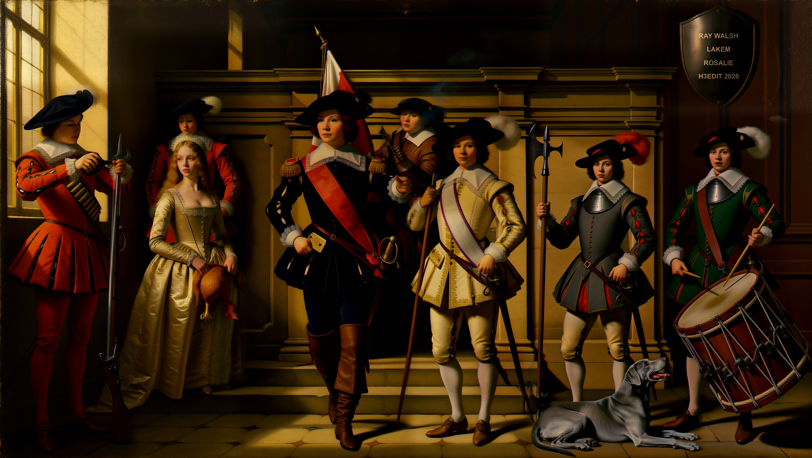
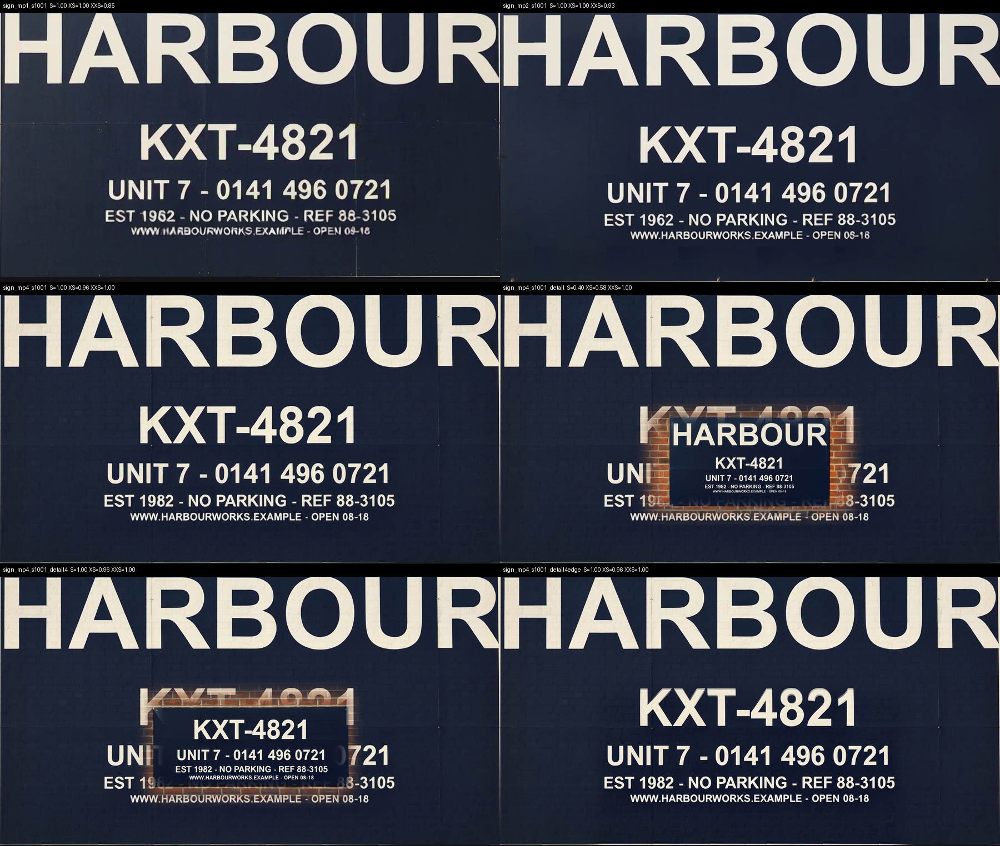

# h3edit-mac — MiniMax H3 image editing on Apple Silicon (ComfyUI + CLI)

MiniMax H3 is an open-weight 33B **video** model. Run in reference-to-video (R2V) mode, rendered for exactly **one frame** and decoded through the video VAE, it becomes a strong instruction-based **image editor**. The technique is [Patient_Ratio4177's](https://www.reddit.com/r/StableDiffusion/comments/1vo1ab3/h3_as_a_singleimage_edit_model/), CUDA-only as published; **this repo is the Apple Silicon port**. It ships a ComfyUI workflow, a single-frame compatibility node, and an `h3edit` CLI that queues the bundled workflow through a running ComfyUI server.


*Two references in (a bare wall, a flat artwork), one image out. Brick texture stays visible through the painted area; the design stops at the window opening.*

```sh
h3edit "$(cat demos/prompts/gable.txt)" \
  -r demos/refs/gable_scene-s77.png -r demos/refs/gable_mural-s79.png \
  --ar 16:9 -o out.png --wait
h3edit --doctor
```

## Demos

All references are AI-generated (Ideogram 4 for artworks, Krea 2 for scenes), all fictional brands. Left: inputs. Right: output.

| | observed in this render |
|---|---|
|  | Type compresses around the **cylinder**; condensation sits **on top of** the label. |
|  | The sign behaves as a **light source**: glow on brick, plus a second coloured reflection in the wet pavement. |
|  | **Perspective warp** — horizontals converge with the cover's edges, stopping at the boards. |

**Reproduce any demo exactly:** every PNG in `demos/out/` embeds its full ComfyUI graph — drag one into ComfyUI, seed and prompt included. Prompts in [`demos/prompts/`](demos/prompts), reference specs in [`demos/specs/`](demos/specs). Seeds: can `58413360`, gable `123494846`, neon `1035877917`, book `583954935`, tattoo `733870745`.

### Not good at everything


Two attempts could not make a tattoo read as ink **under** skin — both look pasted on, and the tiger's face deforms. Flat graphics and type preserved best; curvature, relief, perspective and light usually reproduced; detailed illustration degraded.

Also true everywhere: this is **regeneration conditioned on the references, not a masked edit**. Scene, lighting and composition carry; fine detail gets redrawn. Right for mockups; wrong if output must composite pixel-exactly.

## Install

Clone this repo and `cd` into it. Tested: **M5 Mac, 48 GB unified memory**, ComfyUI 0.32. No minimum-memory configuration established. Downloads total ~33 GB; a run wants ~30 GB free.

Required custom node packs: **[ComfyUI-GGUF](https://github.com/city96/ComfyUI-GGUF)**, **[ComfyUI-ClipProj](https://github.com/nicolab28/ComfyUI-ClipProj)** and **[comfyui-obvpm](https://github.com/obvpm/comfyui-obvpm)** (registers the `beta57` scheduler; otherwise `--scheduler simple`, untested).

**1. Models (~33 GB).** Check licenses before commercial use. Paths relative to ComfyUI's `models/` dir, exact:

| file | put at | size | from |
|---|---|---|---|
| `MiniMax-H3-FL2VA-Pruned-Q5_K_M.gguf` | `diffusion_models/_h3/` | 14.1 GB | [Abiray/MiniMax-H3-Pruned-GGUF](https://huggingface.co/Abiray/MiniMax-H3-Pruned-GGUF) |
| `qwen3vl_8b_fp8_scaled.safetensors` | `text_encoders/_h3/` | 10.6 GB | [Comfy-Org/Qwen3-VL](https://huggingface.co/Comfy-Org/Qwen3-VL/tree/main/text_encoders) |
| `mmh3-8b-ClipProj-celeb-mlp.safetensors` | `clip_projections/` | 0.4 GB | [NicoLab28/ClipProj-MiniMax-H3](https://huggingface.co/NicoLab28/ClipProj-MiniMax-H3) |
| `minimax_h3_video_vae_fp16.safetensors` (decode, preferred — see below) | `vae/_h3/vae/` | 3.2 GB | Comfy-Org/MiniMax-H3 |
| `minimax_h3_t1_image_vae_step1597.safetensors` (optional, grid-prone) | `vae/_h3/vae/` | 5.2 GB | [Mamad8/MiniMax-H3-Image-VAE](https://huggingface.co/Mamad8/MiniMax-H3-Image-VAE) |
| `minimax_h3_audio_vae_fp32.safetensors` | `vae/_h3/vae/` | 0.6 GB | [Comfy-Org/MiniMax-H3](https://huggingface.co/Comfy-Org/MiniMax-H3) |
| `H3-PK-Parasyte-Turbo.safetensors` | `loras/` | 2.1 GB | [Plaguekind/H3-Lora](https://huggingface.co/Plaguekind/H3-Lora) |

(The audio VAE is required even for stills.)

**Prefer the GUI?** Drag [`h3_image_edit_mac.json`](h3_image_edit_mac.json) into ComfyUI — 21 nodes, pre-loaded with the mural demo (copy the two images from `demos/refs/` into `input/` first).

**2. Single-frame compatibility node:**

```sh
ln -s "$(pwd)/custom_nodes/h3_single_frame" /path/to/ComfyUI/custom_nodes/h3_single_frame
```

Enables `length=1` without modifying ComfyUI. **Restart ComfyUI after linking.** (Stock ComfyUI floors H3 at 5 frames; frame 0 of a 5-frame render gives grid artifacts under the image VAE.)

**Decode with the video VAE.** 2-D FFT grid score on matched seeds: the image VAE leaves a faint 16-px grid (harmonic 33–84× background); the video VAE scores 3.6–12× — clean range. Verified on CUDA and Apple Silicon (can demo: 16-px harmonic 9.8 → 4.0). Bundled graphs load the video VAE in node 119.

**3. The CLI:**

```sh
uv tool install --force -e .
h3edit --doctor
```

`--doctor` checks ComfyUI, the compatibility node in the *running* server, and the graph's reference inputs. If ComfyUI is not on `127.0.0.1:8288`, set `H3EDIT_COMFY`; `H3EDIT_INPUT`/`H3EDIT_OUTPUT` point at `input/` and `output/` (defaults assume `~/ComfyUI-h3/`).

## Usage and dials

```sh
h3edit "Task: Reference-guided generation. ..." -r scene.png -r artwork.png \
  --ar 16:9 --seed 42 -o out.png --wait
```

| flag | default | why |
|---|---|---|
| `--lora` | `H3-PK-Parasyte-Turbo.safetensors` @ 1.5 | turbo lane; `--lora off` = base, then `--steps 20 --sampler euler --scheduler simple` |
| `--steps` | 8 | with turbo LoRA; 20 for base (14–50 flat) |
| `--sampler` / `--scheduler` | `er_sde` / `beta57` | LoRA author's recipe; equal to 20-step base at 46 % of the time |
| `--mp` | 4.0 | reference-resolution and lettering dial — also caps references |
| `-r` | up to 5 | slots 3–5 added by cloning the exported LoadImage entry |
| `--ref-size` | `match` | `max`: 72:48 total; `match`: 7:30. No visible gain from `max` |
| `--ar` | `21:9` | match your scene (all demos `16:9`) |

**Megapixels is secretly the reference-resolution — and lettering — dial.** With `match`, references scale *down* to the generation's pixel area: at `--mp 1.0` a 1024px wordmark was squashed to ~650px and came back airbrushed. 2.0 is clean for large marks, but the VAE is **16 px per latent cell**: a ~50-px door plate spans three cells and comes back as mush at 2.0. At **4.0** the same plate, fleet number and phone digits read (measured 2026-09-09, seed-matched). M5: **~13 min** at 4 MP / 8 steps / 5 refs (28 min for 20-step base); ~7–10 min at 2 MP / 2 refs.

**Judge at 100%, never thumbnail size** — clean-looking small renders can hide deformed letterforms.

**Did not help (same seed, 2026-09-09):** the fl2va/ref2va `b25-49` hybrid DiT (indistinguishable from FL2VA; its GGUF carries arch tag `minimax_h3`, rejected by city96's loader, vs Abiray's `wan`); 20 → 50 base steps; close-up references for small text. Output pixels per detail is the lever.

## Detail pass (`--detail`)

```sh
h3edit "$(cat prompts/detail_pass_example.txt)" \
  --detail 1560,700,2320,1460 --source out.png -r door_closeup.png -o out_detailed.png
```

The box is cut from `--source`, inserted as `<Picture 1>`; `-r` images follow as `<Picture 2>`…; the render (2 MP default, aspect snapped to the box) is scaled back and blended with a 48-px feathered edge (`--feather`). Truck cab test (760-px box of a 4 MP frame): all lettering legible, seam invisible, +6.5 min. Prompt as in `prompts/detail_pass_example.txt`: `<Picture 1>` supplies everything, `<Picture 2>` is the lettering authority, "do not add, move or remove anything".

**Prefer `--inpaint` when a region is wrong rather than soft.** It re-denoises a box of `--source` from an encoded latent with everything outside the box frozen, and your `-r` artwork is the only reference:

```sh
h3edit "$(cat benchmark/inputs/sign_inpaint_artref.txt)" \
  --inpaint 400,324,2112,1288 --source out.png -r plate.png --denoise 0.85 -o out_fixed.png --wait
```

On the [benchmark](benchmark/README.md#5-second-pass-candidates-what-actually-fixes-lettering) it corrected a wrong digit, kept the plate's size and position, and left the wall pixel-identical, in 27 s on a 5090 (base model, 20 steps). `--denoise 1.0` re-composes the box instead. Needs ComfyUI-MAINodes (`H3V2VInit`; `--doctor` checks). Do not pass the source as `-r`: as a reference the model copies its own mistakes at any denoise. Local turbo-LoRA lane untested for this pass; measured on the pod's base lane.

Two rules from the [benchmark](benchmark/README.md#3-detail-pass---detail--works-with-two-caveats): **the box must include a physical edge of the object** (a crop that is only flat panel and text gets a whole new plate hallucinated inside it), and **it sharpens, it does not correct** — a wrong digit in the base render survives the pass; reroll the base seed for that.

## Benchmark

Six scripted stress tests, pinned seeds, shipped inputs: [`benchmark/`](benchmark/README.md). On a 5090 at 4 MP, **8 of 8 seeds render every line of a five-tier plate down to 23-px caps at ≥0.96 character accuracy**; lettering holds to ~17 px caps and starts inventing characters at 12 px. The one miss in 40 lines is a single digit swap (reroll). Also measured: what survives outside the edit (large structure yes, brick texture no), the neon sign's pavement reflection (ΔE 21, local) versus its glow on brick (barely measurable), and seven second-pass candidates against one wrong digit — tiling fails, `--inpaint` and a latent-upscale refine fix it.

**Stress test:** a 16 MP group painting built from a blank canvas by H3 alone in 25 masked passes (15 on a pod, 10 local repairs), every pass leaving the rest of the canvas at SSIM 1.000: [`benchmark/nachtwacht/`](benchmark/nachtwacht/README.md).





## Prompt grammar

Cite images as `<Picture 1>` / `<Picture 2>`:

1. `Task: Reference-guided generation.`
2. A negative role assignment for the asset image: *"`<Picture 2>` is the label artwork reference and supplies nothing else. It does not supply a scene, a container, a background, or lighting."*
3. The edit, with **"exactly one"** stated in words.
4. An exhaustive **preserve list** for `<Picture 1>`.
5. Closing: *"A single coherent photograph shows …"*

Every demo prompt follows this shape. The author's 11 worked prompts: [`prompts/reference_prompts.txt`](prompts/reference_prompts.txt) — some use three or four references; the CLI takes up to five.

**Making reference artwork:** H3 transfers art literally, including borders, barcodes and garbled micro-text. Generate clean, asset-only artwork; avoid category nouns that summon packaging furniture (*poster* added a border, *label* an ingredient panel and barcode — *mural painting* and *banner* were clean); keep wordmarks near centre if they must survive a cylinder wrap (only ~40% of a full-width strip shows).

## The graph

The CLI queues the bundled `api_graph.json` — ComfyUI's own `graphToPrompt()` export, because H3's references only serialize correctly through the frontend (as dotted `ref_images.ref_image_N` keys; a hand-assembled graph drops them silently). The CLI refuses to queue if those keys are missing. To modify wiring: edit `h3_image_edit_mac.json` in the GUI, re-export with `H3EDIT_CDP=<port> h3edit --export <tab-id>`.

## Credits

- **Technique**: [Patient_Ratio4177](https://www.reddit.com/r/StableDiffusion/comments/1vo1ab3/h3_as_a_singleimage_edit_model/)
- **Single-image VAE**: [Mamad8/MiniMax-H3-Image-VAE](https://huggingface.co/Mamad8/MiniMax-H3-Image-VAE)
- **Turbo LoRA**: [Plaguekind/H3-Lora](https://huggingface.co/Plaguekind/H3-Lora)
- **Pruned FL2VA GGUF**: [Abiray/MiniMax-H3-Pruned-GGUF](https://huggingface.co/Abiray/MiniMax-H3-Pruned-GGUF)
- **ClipProj**: [NicoLab28/ClipProj-MiniMax-H3](https://huggingface.co/NicoLab28/ClipProj-MiniMax-H3), [nicolab28/ComfyUI-ClipProj](https://github.com/nicolab28/ComfyUI-ClipProj)
- **Text encoder**: [Comfy-Org/Qwen3-VL](https://huggingface.co/Comfy-Org/Qwen3-VL)
- **MiniMax H3**: MiniMax, via [Comfy-Org/MiniMax-H3](https://huggingface.co/Comfy-Org/MiniMax-H3)

This repo's contribution: the Apple Silicon port, the compatibility node, the CLI, and the measured dial table.

## License

MIT. The models carry their own licenses — check before commercial use.
