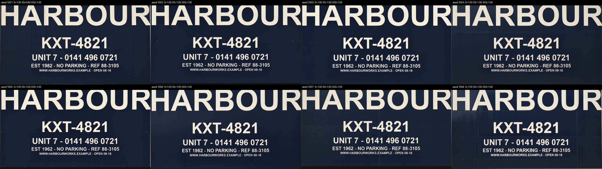
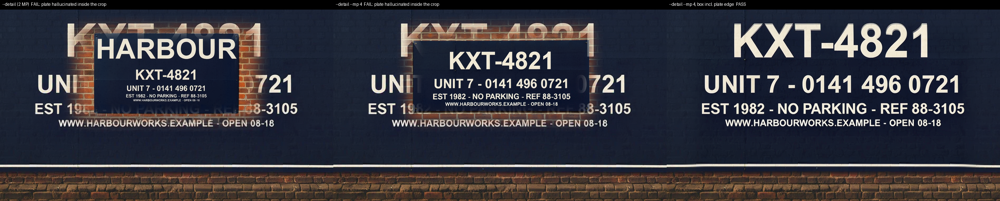

# h3edit benchmark

Five reproducible stress tests for one-frame H3 editing. Every input is a shipped demo reference or
a PIL-drawn plate (committed in `inputs/`), seeds are pinned, and every score is computed by a
script, so anyone can re-run it. Numbers below: **RTX 5090, base model, 20 steps euler/simple,
video VAE, 2026-09-09** (the pod standard). The local Mac path (turbo LoRA, 8 steps) runs the
same suite with `--backend local`.

```sh
python3 benchmark/make_inputs.py                      # regenerate inputs (optional, they are committed)
python3 benchmark/run.py --backend local              # 12 renders, ~4 MP each
python3 benchmark/score.py                            # -> out/scores.json, out/report.md, out/sheet_*.png
python3 benchmark/run.py --backend local --stage detail && python3 benchmark/score.py
```

Scoring needs Pillow, numpy, scikit-image and the `tesseract` binary.

## Headline

**Lettering reads reliably down to ~17 px cap height; 12 px is where it starts to go.** At 4 MP,
8 of 8 seeds render every line of a five-tier plate (231 px down to 23 px caps) with ≥0.96 character
accuracy. The one miss in 40 line-renders is a single digit (seed 1001 paints `1982` for `1962`),
which is exactly the stochastic failure you should reroll for. Below 17 px caps the model starts
inventing characters.


## 1. Lettering ladder

A PIL-drawn sign plate with five lines of decreasing size is mounted on the gable wall demo scene.
Per-tier character accuracy (best OCR line vs ground truth, alphanumerics only), cap height in output
pixels in brackets.

| MP | output | L | M | S | XS | XXS |
|---|---|---|---|---|---|---|
| 1 | 1376x768 | 1.00 (116px) | 1.00 (58px) | 1.00 (31px) | 1.00 (18px) | 0.85 (12px) |
| 2 | 1920x1088 | 1.00 (166px) | 1.00 (83px) | 1.00 (45px) | 1.00 (26px) | 0.93 (17px) |
| 4 | 2720x1536 | 1.00 (231px) | 1.00 (116px) | 1.00 (63px) | 0.96 (37px) | 1.00 (23px) |

The lever is pixels per glyph, not megapixels as such: this plate fills most of the frame, so even
1 MP gives the small lines 18 px. A door plate that is 5% of the frame needs the same cap heights,
which is why `--mp 4` is the default and why the detail pass exists.

## 2. Seed stability (4 MP, 8 seeds)



| seed | L | M | S | XS | XXS |
|---|---|---|---|---|---|
| 1001 | 1.00 | 1.00 | 1.00 | **0.96** | 1.00 |
| 1002–1008 | 1.00 | 1.00 | 1.00 | 1.00 | 1.00 |

Seven seeds are perfect. Seed 1001 renders `EST 1982` for `EST 1962` on an otherwise flawless plate.
Digit swaps are seed-dependent; the fix is a reroll, not a prompt change.

## 3. Detail pass (`--detail`) — works, with two caveats

`--detail` re-renders a box of the output as its own frame and pastes it back feathered. Run on the
weakest seed's lower four lines (box = 29% of the frame width):



| pass | M | S | XS | XXS | seam SSIM | verdict |
|---|---|---|---|---|---|---|
| single pass, 4 MP | 1.00 | 1.00 | 0.96 | 1.00 | | |
| `--detail` (2 MP), box inside the plate | 0.46 | 0.40 | 0.58 | 1.00 | 0.930 | **FAIL** — a whole new plate hallucinated inside the crop |
| `--detail --mp 4`, box inside the plate | 1.00 | 1.00 | 0.96 | 1.00 | 0.929 | **FAIL** — same hallucination; OCR read the inner plate |
| `--detail --mp 4`, box includes the plate's bottom edge | 1.00 | 1.00 | 0.96 | 1.00 | 0.987 | **PASS** — sharper glyphs, invisible seam |

- **Give the crop an edge.** A box that is nothing but flat panel and text reads as "empty wall,
  mount the reference here" and the model composes a fresh plate inside it, twice, with two
  different prompts. Include a physical edge of the object (plate border, brick below) and it
  behaves as a sharpen pass. This matches the truck-door case it was built on, where the crop
  always contained the door seams.
- **It sharpens, it does not correct.** All three passes reproduce `1982` from the crop even though
  the prompt names the artwork as the authority. Reroll the base render for a wrong character; use
  `--detail` for a soft one.

## 4. Preservation outside the edit

H3 regenerates the whole frame, it never masks. Outside-plate SSIM vs the source scene, and eight
fiducial patches (window, sill, coping, plinth, pavement, sky) re-found by normalized
cross-correlation.

| render | SSIM outside | fiducials kept /8 | weakest patch |
|---|---|---|---|
| 1 MP | 0.44 | 7 | plinth 0.43 |
| 2 MP | 0.58 | 7 | wall right of window 0.38 |
| 4 MP, 8 seeds | 0.50–0.58 | 7–8 | wall right of window 0.49–0.72 |

Large structure survives every time (window, sill, coping, sky all ≥0.86); brick texture, the
plinth and the strip of wall beside the window are re-imagined. Low SSIM here is the honest cost
of a generative edit, not noise: if you need pixel-exact surroundings, composite the plate region
back onto the original yourself.

## 5. Light as a source (neon)


The neon demo rendered lit and, at the same seed, switched off (a desaturated copy of the sign
reference plus an "unpowered" prompt). Mean Lab shift, lit minus unlit:

| region | ΔE00 | toward the sign's pink | ΔL |
|---|---|---|---|
| brick left of the sign | 0.6 | +0.2 | −0.7 |
| brick right of the sign | 0.7 | +0.6 | −0.5 |
| wet pavement below | **20.8** | **+18.2** | +10.9 |
| far control (neighbouring shopfront) | 0.2 | 0.0 | −0.3 |

The pavement reflection is real and strong; the far control confirms it is local, not a global
grade shift. The glow on the brick beside the sign is barely measurable (visible as a faint halo
in the sheet). The demo caption's "glow on brick" claim is weaker than "reflection in the wet
pavement".

## Speed

5090, base model, 20 steps, including model staging and the ~30 s VAE decode:

| MP | output | wall |
|---|---|---|
| 1 | 1376x768 | 139 s |
| 2 | 1920x1088 | 132 s |
| 4 | 2720x1536 | 144–155 s |

Wall time is dominated by model load/offload on a 32 GB card, so 4 MP costs almost nothing over
1 MP here. On an M5 Mac with the turbo LoRA, 4 MP is ~13 min.

## What the metrics can and cannot tell you

- OCR (tesseract) is the judge for lettering. Each text row is found by projection profile and
  rescaled to ~50 px caps before OCR, so a re-flowed layout still scores; a fixed-band crop lost
  two perfectly legible lines in an earlier version. Scores of 0.85–0.95 can still be OCR noise;
  read the contact sheet before calling a miss.
- SSIM/NCC reward pixel fidelity, which a generative editor never has; read task 4 as "what kind
  of thing survives", not a quality score.
- The neon ΔE thresholds are descriptive, not pass/fail.
- 15 renders on one card, one seed set. Rerun before quoting to a decimal.

Full per-render numbers: [`out/report.md`](out/report.md), [`out/scores.json`](out/scores.json).
