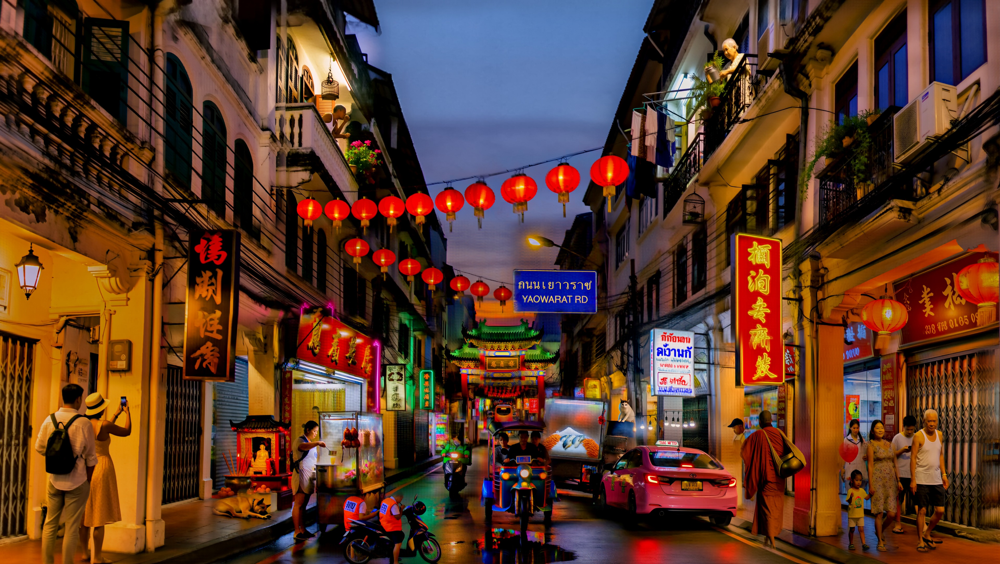
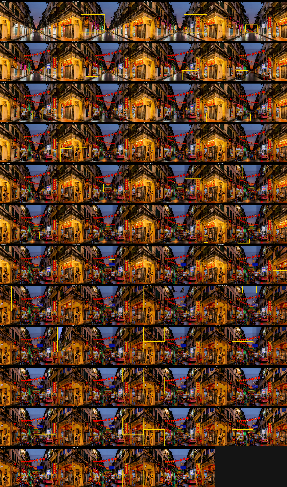

# Bangkok Chinatown: a 16 MP photoreal street built by H3 alone, one masked pass at a time

The second canvas build, and the first photoreal one: Yaowarat Road at dusk, 5440x3072, painted
from an empty street in 24 masked passes with `h3-inpaint`, then re-detailed grid-free with 13
reference-only tiles, every pass on the M5. Nothing outside a pass's box ever moves (outside SSIM
1.000 on all of them). This build also found what the "faint grid" on H3 inpaints is, and its fix.



**Numbers (M5, Parasyte turbo lane, 8 steps, 2026-09-10):** canvas 550 s at 4 MP, then 24 passes at
310–690 s each in ~4 MP windows cut from the 16 MP canvas; seam SSIM 0.95–0.98. Two rounds, one
repair, two misses. Every prompt is in `prompts/`, the plan in `plan.json`, every box and seed in
`state.json`.



## How it was built

```sh
h3edit "$(cat prompts/canvas.txt)" -r refs/palette.png --ar 16:9 --mp 4 --seed 8800 -o out/canvas_4mp.png --wait
# Lanczos x2 -> out/start.png (5440x3072)
h3-inpaint init . --canvas out/start.png
h3-inpaint add  . neon_left --box 688,1088,2496,2448 --prompt neon_left.txt --denoise 0.9   # ... 23 more
h3-inpaint run  .
h3-inpaint show . neon_left      # 1:1 after every pass
h3-inpaint score .
```

The canvas prompt asked for the empty setting only: shophouses, cables, wet road, dusk, "no
vehicles, no people, no stalls, no lit neon yet". Everything else is a box.

## Round 1: fifteen boxes, back to front

| pass | box (px) | denoise | result |
|---|---|---|---|
| neon_left, neon_right | 1808x1360, 1768x1360 | 0.9 | lit vertical signs on both arcades: Chinese, Thai, a green pharmacy sign; the facades untouched |
| far_street | 912x592 | 1.0 | evening traffic at the vanishing point: an orange bus, a tuk-tuk, motorbikes, tail lights |
| lanterns | 2400x992 | 0.85 | two strings of red lanterns across the street; sky and cables kept |
| gold_shop | 928x976 | 1.0 | two shutters became a lit gold shop, red fascia, glass counters, two staff |
| seafood_stall | 1184x736 | 1.0 | cart, ice bed, charcoal grill, red stools, a cook turning skewers |
| noodle_cart | 912x704 | 1.0 | glass-sided cart, hanging roast duck, a woman ladling broth |
| tuk_tuk | 768x608 | 1.0 | head-on, driver and two passengers, reflected in the wet road |
| cat | 376x272 | 1.0 | **miss**: "on the cart's roof edge" put the cat in mid-air beside the awning post |
| taxi | 1408x672 | 1.0 | pink Toyota, lit roof sign, plate; **its box covered most of the seafood stall** |
| scooter | 816x576 | 1.0 | a green delivery rider with a food box |
| crowd_right | 864x1056 | 1.0 | four pedestrians as listed in the prompt, every hand five-fingered |
| tourists | 1008x1120 | 1.0 | a couple photographing the street, backpack, sunhat, phone |
| monk | 544x768 | 1.0 | saffron robes, alms bowl in its sling, barefoot |
| soi_dog | 544x400 | 1.0 | asleep against the column base |

## Round 2: a repair and eight additions

| pass | box (px) | denoise | result |
|---|---|---|---|
| paifang | 672x624 | 1.0 | a lit Chinese gate over the far end of the road; a touch large and saturated for the distance |
| balcony_right | 1216x1056 | 0.9 | a woman watering plants, laundry on the line, a bird cage; facade re-composed a little, coherent |
| balcony_left | 1184x1088 | 0.9 | an old man smoking at the rail, a bamboo cage, bougainvillea; the arched windows intact |
| stall_fix | 432x544 | 1.0 | the floating cat and the bare table frame gone; a glass cart with fish on ice and the cat on its lid, though it stands in the lane behind the taxi rather than on the pavement |
| shrine | 416x756 | 1.0 | red and gold altar, Buddha, joss sticks, oranges, couplets |
| child | 288x552 | 1.0 | a girl with a red balloon holding the floral-dress woman's hand; the dress got repainted lighter and the shopping bag went |
| moto_taxi | 850x352 | 1.0 | two riders in orange vests on a parked scooter, cut by the bottom edge |
| puddle | 800x224 | 0.85 | a mirror sheet of standing water reflecting the tuk-tuk and the neon |
| street_sign | 432x480 | 0.85 | blue Bangkok sign on the lamp post reading exactly ถนนเยาวราช / YAOWARAT RD from an artwork card |

## The faint grid: what it was and what fixed it

Mike kept seeing a faint grid on both canvas builds. Two artifacts, one cause.

1. A horizontal 16 px harmonic, 50–200x background, on every masked-latent pass (`--inpaint`),
   pod and local alike, inside the regenerated box as much as in the frozen area.
2. A per-cell mosaic in smooth areas: each 16 px decoder cell a slightly different tone, 1–3
   levels, a quilt of domes on walls, the sky, the taxi door, the road.

Ruled out one by one on a 1 MP testbed that reproduces both in five minutes (`out/grid/`): the
VAE file (the image and video VAE share the encoder tensor for tensor), fp32 VAE, CPU decode
(identical pixels), 20-step base lane instead of the 8-step turbo lane (same quilt on the identical
box, twice), frame count, scheduler (sigma starts at exactly 1.0), decoding only the box crop,
notch filters, deblocking, template subtraction, bilateral. The encoded latent itself is clean.

The one variable that separates clean from quilted: **whether the sampler ran with an encoded
latent as context.** A plain R2V frame (no latent) is clean; any `H3V2VInit` pass is not, on every
decoder and every lane. So the fix is the pass type, not the decoder: **`h3edit --detail`**
(the box crop as `<Picture 1>`, plain R2V, no latent, feathered paste) renders grid-free and
sharper, and it holds people. In h3-inpaint that is `add --kind detail`.

| test | quilt ratio (1.0 = none) | note |
|---|---|---|
| plain R2V frame | 0.91–1.04 | clean |
| `--inpaint`, turbo 8 steps | 1.17–1.60 | the grid |
| `--inpaint`, base 20 steps | 1.23–1.60 | same |
| `--inpaint`, fp32 / CPU VAE | 1.37–1.43 | same |
| `--detail` of the same box | 0.93–0.94 | clean, and 2x sharper |

## Rounds 3–5: re-detailing with reference-only passes

- **Round 3 (inpaint at 0.75, both facade columns):** sharp, re-composed, still quilted. Kept as
  the record; replaced below.
- **Sky as a lone `--detail` box:** the plate-in-plate failure: a crop of pure sky hallucinated a
  new skyline inside it. Reverted. A reference-only crop must contain a real edge.
- **A 2.2 MP facade column as one `--detail` box:** the perspective drifted, a sky wedge cut into
  the building, the balcony woman moved floors. Reverted. Big architecture boxes drift.
- **Round 5 (the fix): twelve 1600x1280 tiles, each rendered at 4 MP and scaled down, kind
  detail, one generic "reproduce exactly, sharper" prompt.** 15 min each on the M5. Layout held on
  every tile, no seam visible at any of the five overlaps, every figure and hand intact, cell
  boundary ratio 1.0–1.05 everywhere (from 1.2–1.3), sharpness up 20–100% per region. One tile was
  repeated on the 20-step base lane: indistinguishable apart from marginally softer skin.
  Drift that stayed: the taxi's roof sign lost a letter, a wall lamp appeared on the far-left facade.

Final: `out/final.png` = the canvas after 47 logged steps (24 composing passes, 4 filters and
reverts, 3 round-3 passes, 13 tiles); `out/final_4k.jpg`, `out/sheet_makingof.png`, `out/scores.json`.

## Rules this build added

- **Finish every canvas with reference-only tiles** (`--kind detail`, ~1.3 MP boxes rendered at
  4 MP): grid-free and supersampled. Latent `--inpaint` is for composing; it always leaves the grid.
- **A reference-only crop needs a real edge** (a roofline, a column): pure sky or flat wall gets a
  new picture invented inside it.
- **Keep reference-only boxes ~1.3 MP or smaller**: a 2.2 MP facade drifted in perspective, a
  0.9 MP crowd and 1.3 MP tiles reproduced faithfully.
- **Onto a detailed facade with the latent path: 0.9.** Signs and balcony life, four for four.
- **Give an animal a surface.** "On the cart's roof edge" floated; "sitting on the flat steel lid" sat.
- **Vehicles before what they pass.** The taxi box wiped the stall painted before it.
- **Lettering at 0.85 with an artwork card** works for street signs as for the shield.
- **Don't load anything else on the GPU while a build runs.** A second 5 GB VAE pushed the next
  pass into MPS out-of-memory; the build resumed from state.
