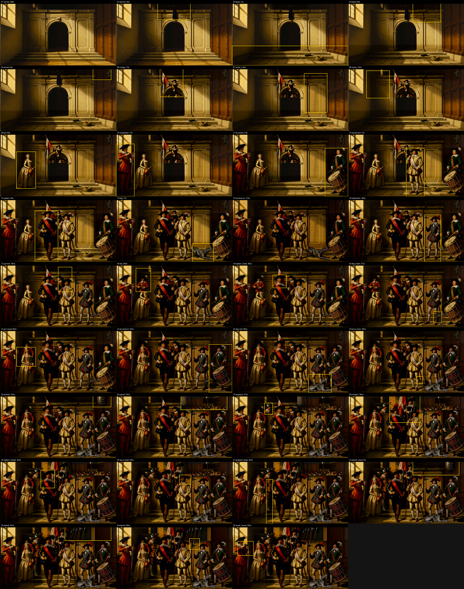

# Nachtwacht: a 16 MP group painting built by H3 alone, one masked pass at a time

The stress test the plate benchmark could not be: an image no single prompt produces, on any
tool. A 5440x3072 militia group portrait in the manner of the Night Watch, painted from a blank
canvas by MiniMax H3 in 35 passes on one canvas. Every figure, prop and the lettered shield is its
own `--inpaint` pass at full resolution; nothing outside a pass's box is ever regenerated.


**Numbers (RTX PRO 6000, base model, 20 steps, 2026-09-10):** 15 passes on the pod, 21 minutes 40 seconds
of wall time end to end, ~65 s per masked pass at 16.7 MP; five more passes locally on the M5 afterwards (round 2 below). Outside every box the canvas stayed at
SSIM 1.000 pass after pass; seam SSIM 0.96–0.98. Total render cost roughly $1.



## How it is built

```sh
python3 benchmark/nachtwacht/build.py --pod <podenv>   # runs the PLAN in build.py, resumable
python3 benchmark/nachtwacht/score.py                  # SSIM per pass, sheets, final_4k.jpg
```

1. **Canvas**: one R2V sample at 4 MP with a palette card as the only reference (colours, no
   scene), then the quality-lane refine (LBH 2x latent upscale + 4-step er_sde): 5440x3072 in 288 s.
2. **Fourteen masked passes, back to front**: banner, steps, pikes, shield, ensign, the ranks
   behind the arch, the girl in gold, musketeer, drummer, lieutenant, captain, dog. Each pass
   encodes the current canvas, wraps it with `H3V2VInit` and a mask over the box, samples at full
   denoise with the reference still (a Krea persona render) as `<Picture 1>`, and pastes only the
   box back onto the canvas through a feathered mask in pixel space.
3. **Harmonize** (full-frame latent pass at denoise 0.35): kept for the record as a FAIL, see below.

| pass | box (px) | outside SSIM | seam SSIM | wall |
|---|---|---|---|---|
| canvas | full frame | | | 288 s |
| banner | 1536x928 | 1.000 | 0.980 | 65 s |
| steps | 5440x928 | 1.000 | 0.981 | 72 s |
| pikes | 1312x1040 | 1.000 | 0.978 | 64 s |
| shield | 864x608 | 1.000 | 0.984 | 64 s |
| ensign | 1088x1376 | 1.000 | 0.979 | 72 s |
| ranks right | 1088x1840 | 1.000 | 0.979 | 65 s |
| ranks left | 1088x1296 | 1.000 | 0.984 | 65 s |
| girl in gold | 912x1728 | 1.000 | 0.982 | 80 s |
| musketeer | 864x2464 | 1.000 | 0.981 | 72 s |
| drummer | 1088x2272 | 1.000 | 0.979 | 64 s |
| lieutenant | 864x2272 | 1.000 | 0.964 | 72 s |
| captain | 1088x2400 | 1.000 | 0.983 | 63 s |
| dog | 992x864 | 1.000 | 0.983 | 72 s |
| harmonize | full frame | 0.877 | | 122 s |

## Round 2: five more boxes, rendered locally

The pod was gone, so passes 16–20 ran on the M5 through `h3edit --inpaint` (turbo LoRA, 8 steps)
in a ~4 MP window cut around each box; the window goes back onto the 16 MP canvas afterwards
(`build.py --backend local`). 380–460 s per pass. Halberdier, a gunner blowing on his match behind
the lieutenant, a figure at the back left, the captain's head redone at denoise 0.85, and a repair
of the dog's head after the halberdier's box clipped it.

| pass | box (px) | window | outside SSIM | seam SSIM | wall |
|---|---|---|---|---|---|
| halberdier | 768x2208 | 1472x2656 | 1.000* | 0.870 | 460 s |
| gunner | 656x1168 | 2656x1472 | 1.000 | 0.985 | 402 s |
| back-left figure | 704x1104 | 2656x1472 | 1.000 | 0.985 | 382 s |
| captain head (0.85) | 656x624 | 2656x1472 | 1.000 | 0.988 | 402 s |
| dog head | 400x528 | 2656x1472 | 1.000 | 0.988 | 372 s |

\* scored against the discarded harmonize state in the log; against the pass-14 canvas it is 1.000
by construction (the window is pasted back whole).

Lessons from the round: boxes overlap what is already painted, so a new figure's box takes the
neighbour with it (the halberdier ate the dog's head; the gunner replaced the ensign). Plan boxes
on empty ground or repair afterwards. "A small boy" came out as another adult in a red coat: with
no identity reference the model defaults to the figures already on the canvas. The local turbo lane
leaves more chroma noise in the box than the pod's 20-step base lane.

## Round 3: repairs, rendered locally

Round 2 broke as much as it added. The "boy" box overlapped the girl's box and replaced her head and
bodice with a red-coated youth; the halberdier box cut the dog off behind the hind legs; the drummer
was cropped by the right frame edge; the lieutenant's scabbard tip had come out as a blob at his knee;
the shield's last line read `H8EDIT`. Five more local passes (same M5 turbo lane, ~4 MP windows):

| pass | box (px) | denoise | fixes | wall |
|---|---|---|---|---|
| girl_head | 912x912 | 1.0 | Rosalie's head and bodice back above the existing skirt; the youth now stands behind her | 682 s |
| drummer2 | 1088x2272 | 1.0 | whole figure inside the frame, wall visible to his right | 422 s |
| dog_full | 1088x864 | 1.0 | the whole dog in one box that includes the halberdier's shins | 382 s |
| lieut_knee | 288x352 | 1.0 | knee band and hose, nothing hanging | 382 s |
| shield2 | 864x608 | 0.85 | lettering corrected with the artwork as reference; the oval became a larger heraldic shield, so 0.85 did not pin the geometry here as it did on the plate | 342 s |

The rule for box size, learned the hard way: a box must contain everything you are re-composing plus
a strip of finished ground on every side. Too small and you clip a body or decapitate a neighbour;
too big only costs you the neighbours inside it, which the model repaints in context (the dog box
took the halberdier's shins with it and joined them cleanly). Repairs go bigger, not smaller, and
back to front: the drummer was redone before the dog because the drummer's box covers the dog's head.

## Round 4: filling the empty wall, giving the flag a bearer

Nine more local passes (one a pixel-space revert), boxes now given in pixels. The interesting ones:

| pass | box (px) | denoise | result |
|---|---|---|---|
| pikes2 | 2176x800, empty dark wall | 1.0 | **FAIL**: the model composed a whole gallery of militiamen behind a parapet inside the box, cut hard at the box edge, with a tone shift at the left edge. An empty box has nothing to anchor to, so it becomes a fresh picture (the plate-in-plate failure again). Region reverted in pixel space. |
| pikes3 | same box | 0.8 | wall stays dark, a rack of pike shafts and a halberd added; the shield is gone from the wall as a side effect of the box |
| pikes4 | 480x512 | 0.8 | tried to carry the shafts down past the cornice: **no visible change**, at 0.8 the lit stone panel wins and nothing is added; the rack stays resting on the cornice |
| sergeant | 384x544 | 1.0 | a bearded old sergeant in a morion, head and shoulders in the gap between the youth and the flag |
| sergeant_body | 304x2072 | 1.0 | his body continued down the narrow slot to the steps; without it the head floated over bare wall |
| ensign2 | 1424x1408 | 1.0 | Ray as the flag bearer, both hands on the pole, banner furled beside him. The box had to cover the captain's and the lieutenant's heads, and both came out as new people, so: |
| captain_head2, lieut_head | 656x848, 544x448 | 1.0 | both heads repainted in front with their references |

Two more rules from this round. **An empty box is a blank page**: at denoise 1.0 the model composes a
new picture in it; to add props to bare wall use 0.8 so the wall itself survives. **Anything inside a
box is fair game**, references or not; plan the sequence so that whatever a big box destroys gets
its own pass afterwards, back to front.

## Round 5: hands

A 1:1 audit of every hand on the canvas found one with six fingers: the musketeer's flask hand,
from the original pod pass. The same figure's weapon had a musket lock and stock at the bottom and
a fork head at the top. One 752x672 box at denoise 1.0 over both hands and the muzzle fixed both
(five fingers, plain muzzle, flask tipped over it); the bandolier that crossed the box went with it.
Every other hand (ensign, captain, lieutenant, halberdier, drummer, girl) counted five.

## What it proved, and what it did not

- **The latent path holds a canvas indefinitely, if you paste back in pixel space.** The first
  build did not: every masked pass re-decoded the whole latent, the frozen area took a VAE
  round-trip each time, and by pass 7 the painting had gone dark and muddy. Pasting only the box
  back fixed it completely (outside SSIM 1.000 for 13 consecutive passes). The harmonize pass shows
  the same drift in one step: one full-frame round-trip at denoise 0.35 darkened the whole image.
  Full-frame passes on a finished canvas are the wrong tool; the pass-14 canvas is the final.
- **Composition by inpainting works.** A box at denoise 1.0 invents a figure that stands on the
  canvas's steps, in its light, at the right scale, with the surroundings as context through the
  frozen latent. Paint back to front: a later box overwrites an earlier one.
- **Identity is the weak score.** The faces read as "a painted person", not as the persona in the
  reference; the white streak in Ray's hair, for instance, did not survive. A face that is ~150 px
  in a 16 MP frame gets little of the reference's detail, and the painted style pulls the rest
  toward generic. Bigger boxes with the face larger, or a second pass on the head alone, are the
  obvious next test. The shield names are legible by eye at 1:1 (tesseract scores them low because
  they are small and gold on dark).
- **The build is reproducible**: fixed seeds per pass, prompts in `prompts/`, the plan in
  `build.py`. Reference stills are not committed (persona renders); drop your own in `refs/`.

## Cost of the alternative

No cloud image editor accepts a 16 MP canvas and returns it with the untouched 90% pixel-identical;
they regenerate at 1–4 MP. A one-shot prompt for this scene is left as an exercise; it will not
place six specific people, a named shield and a chicken.
