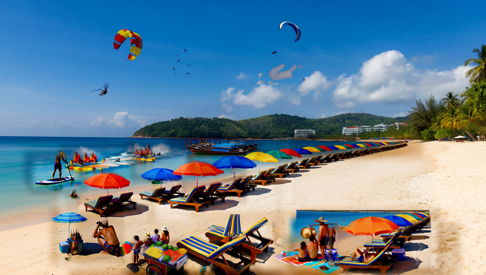

# Patong Beach: a busy 16 MP beach day, and what empty regions do to masked inpainting

> **This is a failure analysis, not a quality showcase.** The final image has visible defects at
> presentation size: rectangular insertion patches, a pasted photo-in-photo in the lower right with
> its own second waterline, half-transparent ghost figures, and a grey blob in the sky. It is kept
> because it maps exactly where masked inpainting breaks (large flat regions). For what the method
> does well, see [Nachtwacht](../nachtwacht/README.md) and [Bangkok](../bangkok/README.md).

The third canvas build, and the one that mapped the failure mode the first two never hit: **large
empty regions**. Patong Beach in Phuket at midday, 5440x3072, built from an empty bay on an M5
overnight with `h3-inpaint`. Around forty composed elements — parasails, boats, a long umbrella
row, dozens of loungers, crowds, vendors — then finished grid-free with reference-only detail
tiles. Two whole-frame pixel repairs were needed that the Nachtwacht and Bangkok builds never were.

**Numbers (M5, Parasyte turbo lane, 8 steps):** canvas 550 s at 4 MP, then 88 kept passes — 51
masked `--inpaint` composes, 35 reference-only `--detail` tiles, 2 whole-frame pixel repairs — plus
16 reverts. Every prompt is in `prompts/`, every box and seed in `plan.json` / `state.json`.

## Why this build was different

Nachtwacht (a painted hall) and Bangkok (a dense street) worked because **every box had detailed
content on several sides to anchor to**. A beach is mostly three big flat fields: sky, open water,
dry sand. A masked box dropped into flat, near-uniform pixels has almost nothing to preserve, so
the model stops "editing" and starts "painting a new picture." That single fact caused every
failure here, in three variants.

### 1. Compose over flat sky or open water hallucinates a whole scene

The first parasail box (denoise 0.9, mostly empty sky) rendered a good parasail **and** a
hard-edged framed beach photo floating in the blue beside it. Same for a palm-frame box in a sky
corner. The fix, proven on a probe:

- **Sky objects: denoise 0.8, box tight to the object.** Less empty area inside the box, less room
  to invent.
- **Open-water objects: denoise 0.85, box around the object**, ideally catching the shoreline edge.

| region | denoise | box rule | probe |
|---|---|---|---|
| sky | 0.8 | tight to the object | clean parasail |
| open water | 0.85 | around the object | clean jet ski |
| dry sand | 1.0 | box must include the waterline, **or** hug the object with a sand-only prompt | clean umbrella row |

### 2. Compose over flat sand does the opposite at low denoise, and invents sea at high denoise

An umbrella row at 0.9 on bright dry sand came back as a **grey smudge** — the sand survived, the
umbrellas never rendered ("0.8 won't paint over lit ground", the same rule the earlier builds
found). Raising to 1.0 made the umbrellas appear, but a tall box with empty sand above the object
filled that empty band with an **invented sea horizon up on the dry beach** (a volleyball court and
several loungers all grew their own waterline). Two placements that work:

- **Back rows: denoise 1.0, put the real waterline at the top of the box.** The model continues the
  true sea instead of inventing one; the umbrellas compose on the sand below.
- **Objects up on dry sand: denoise 1.0, box hugging the object** (no empty band) **plus a prompt
  that says the frame is dry sand on all sides, no water, no sea, no horizon.** A tall box or a
  generic prompt brings back the phantom sea.

### 3. The detail finish hallucinates over empty regions too

The grid-removal tiles that finished Bangkok cleanly **cannot** be run blindly here: a
1600x1280 tile that is mostly empty sky re-invented a rocky coastline in its lower half. So the
finish is **selective**, not a blanket grid:

- The grid only exists where `--inpaint` ran. The empty sky, open sea and bare sand are still the
  original clean canvas — leave them alone.
- Detail the **objects** (tight boxes) and the **dense beach band** (Bangkok-style tiles). Never
  tile flat emptiness.
- Smaller detail boxes = higher fidelity. Every tile renders at 4 MP regardless of box size, so an
  ~800 px box is a ~6x supersample versus ~2x for a 1600 px tile. Faces and clusters get their own
  small boxes.

## The sky ring, and why pixels beat passes for it

Even a clean tight parasail left a faint **rectangular tone-ring**: `--inpaint` shifts the whole
box's tone a little, and against flat blue that step is a visible rectangle. A tight `--detail`
sharpens the object but leaves the ring; a larger `--detail` hallucinates. Neither pass removes it.

The fix was a pixel op, not a pass: **restore the sky to the original clean plate everywhere the
pixel is close to plain sky, keep only the vivid object pixels** (parasail colours, dark birds,
lines — everything more than ~70 levels from the base sky). Rings vanish, objects stay. Logged as
`sky_clean`.

## The right-third rebuild

By the second density wave the right-centre had stacked too many overlapping 1.0 boxes — each with
its own tone step and one with a mis-toned blue patch — into a patchwork the detail tiles could not
blend. Because the underlying beach is identical in the pre-wave state, the cleanest repair was a
**feathered pixel restore of the right third from the earlier clean canvas** (`rebuild_right`),
then re-adding a few right-side objects with the tight-box, sand-only method. A seam is invisible
when both sides share the same base image.

## Rules this build added (beyond Nachtwacht and Bangkok)

- **A masked box needs content to anchor to.** Over flat sky / water / sand it invents a scene
  (high denoise) or smears (low denoise). Give it an edge or hug the object.
- **Sky 0.8, open water 0.85, dry sand 1.0** — and dry-sand boxes must include the waterline or use
  a tight box with a "dry sand, no sea, no horizon" prompt.
- **Finish selectively.** Detail the objects and the busy band; never detail-tile flat emptiness.
- **Smaller detail boxes for fidelity** — same 4 MP render, more supersampling.
- **Some artifacts are cheaper to fix in pixels than in passes** — the sky tone-ring and a
  seam-patchwork region were both repaired with a masked composite against a known-clean plate,
  logged as pixel passes, rather than fought with more inpaint/detail.
- **Watercraft and figures on bright flat sand are stochastic** at 1.0 — one lounger box lands, the
  next smears. Audit at 1:1 and reroll under a new name; do not assume a setting that worked once
  will hold.

## Honest residuals

Visible at 2k, not just at 1:1: a half-transparent ghost figure in the right-mid sand; the
foreground-right vendor cluster sits in a rectangular patch that is a whole second beach photo, with
its own sea and waterline cutting across the sand; soft rectangles around the paddleboarder and the
left jet-ski group; and a flat grey cloud blob in the upper sky. All are compose/paste artifacts of
boxes over flat ground, left in rather than risk another round of seams. Fixing them would mean
reverting and re-planning those boxes (tighter boxes, lower denoise, a waterline in every sand box). `out/final.png` is the full 5440x3072;
`out/final_4k.jpg`, `out/final_2k.jpg` the exports.
